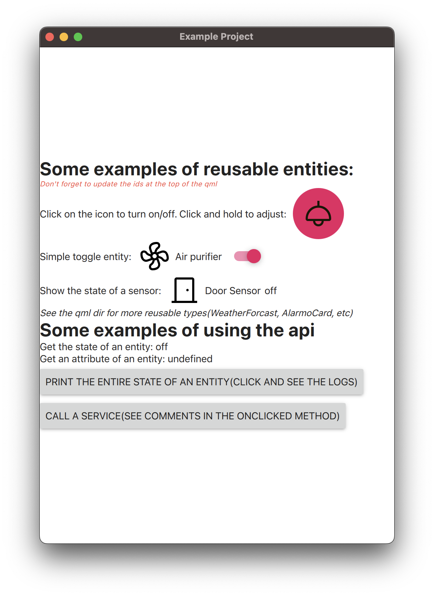

# QHomeAssistant

A simple QML interface to HomeAssistant, implemented by making calls to the [Home Assistant REST API](https://developers.home-assistant.io/docs/api/rest/). The API is trying to be as similar as possible with the templating state functions: [Templating/States in Home Assistant](https://www.home-assistant.io/docs/configuration/templating/#states)

This project uses [Material Design Icons](https://github.com/google/material-design-icons)

Please note: This is a simple library/QML module I created for some home projects with just the features I required. Feel free to improve/use/extend.

A good starting place is the [ExampleProject](ExampleProject)



# Example

See [ExampleProject](ExampleProject) for more detailed examples.

```qml
//Code taken from the ExampleProject

// Import the QML module
import QHomeAssistant 1.0

// Get the state of an entity(See HomeAssistant.qml for the complete API)
Label {
    text: HomeAssistant.state(root.lightId)
}

// Get a state attribute of an entity
Label {
    text: HomeAssistant.state_attr(root.lightId, "brightness")
}

// Call a service
Button {
    text: "Call service"
    onClicked: {
        HomeAssistant.call_service("light.turn_on", root.lightId, {"brightness": 255});
    }
}

// Use one of the provided QML types(see the qml/ directory for more types)
LightIcon {
    entityId: root.lightId
}
```

# How to use it
The project is built using CMake. So you can simply add it as a git submodule to your project and add a `add_subdirectory(QHomeAssistant)` call to your root CMakeLists.txt

After you get it building, link it to your application via a `target_link_libraries(MyProject PRIVATE QHomeAssistant)` call. 

You then only need to call `QHomeAssistantPlugin::initialize(engine, haUrl, haToken);` in your main.cpp file, before the call to `engine.load(url)`. Using this initialzation call, the lib will register all the relevant QML types and also configure the home assistant URL and the home assistant Long-Lived Access Tokens(which is the token required to access the HomeAssistant REST API).

After that, you should be able to just import the module in QML and make calls and use the predefined QML types. 

See the [ExampleProject](ExampleProject) from this repo for examples on how to set this up and how to use the API and provided QML types.

# How it works
TODO